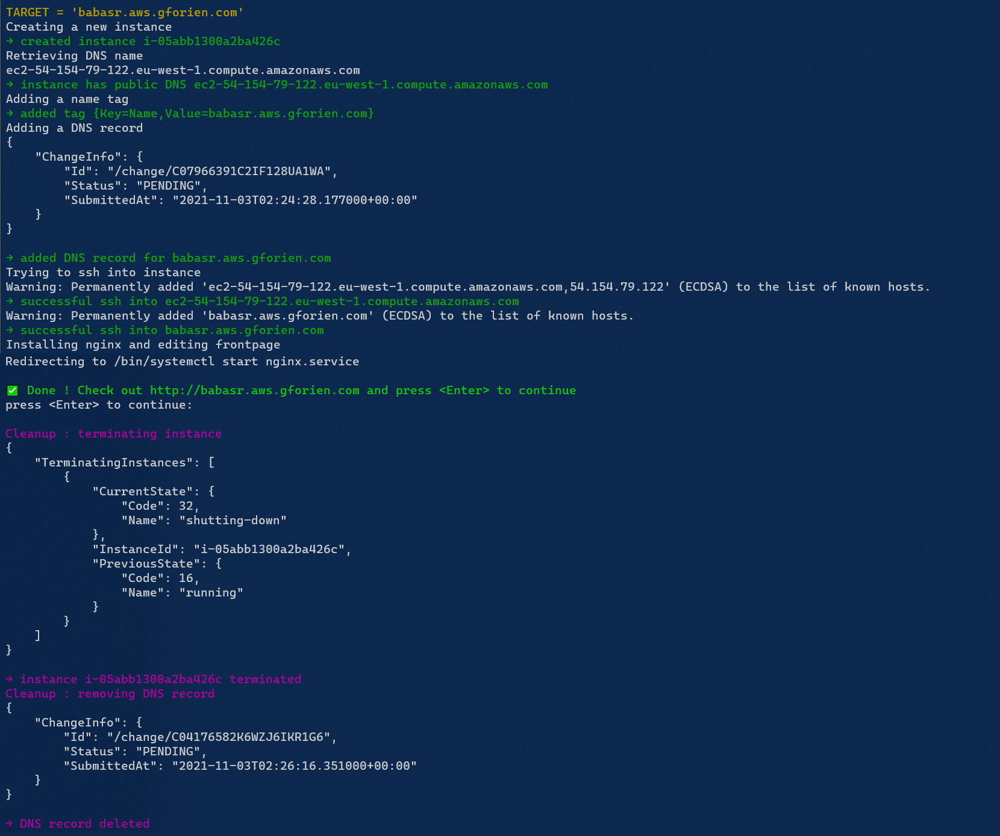
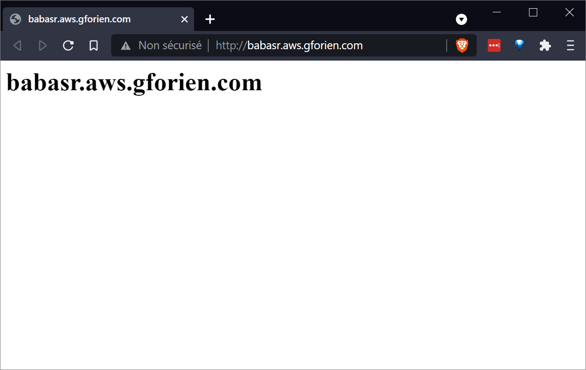

# create-aws-website
### Create a static NGINX website on AWS EC2 from Powershell ⚡

### 👷‍♂️ Usage
```sh
# dot-source the script file
. ./script.ps1

# execute
Create-AWS-Website babar.aws.gforien.com
```


### ✨ Result


#### Gabriel Forien <br> INSA Lyon
